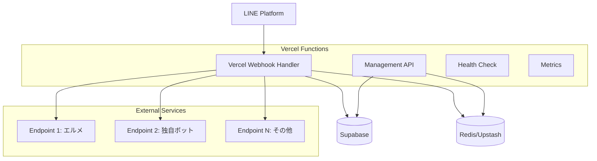

# Design Document

## Overview

LINE Webhook ProxyはVercelのサーバーレス環境とSupabaseを活用したWebhook転送プロキシサービスです。LINE公式アカウントからのWebhookを受信し、設定された複数のエンドポイントに並行転送することで、1つのLINE公式アカウントで複数のサービスを同時利用可能にします。

### Key Design Principles

- **サーバーレスファースト**: Vercelの制約（10秒実行制限、ステートレス）に最適化
- **高可用性**: 単一障害点を排除し、99.9%のアップタイムを実現
- **コスト効率**: 従量課金モデルに適した効率的なリソース利用
- **セキュリティ**: LINE署名検証とAPIキー認証による多層防御

## Architecture

### System Architecture



### Technology Stack

- **Runtime**: Node.js 18+ (Vercel Functions)
- **Framework**: Next.js 14 with App Router
- **Database**: Supabase (PostgreSQL)
- **Cache**: Upstash Redis (Vercel integration)
- **Monitoring**: Vercel Analytics + Custom metrics
- **Security**: JWT tokens, LINE signature validation

## Components and Interfaces

### 1. Webhook Handler (`/api/webhook/[accountId]`)

**Purpose**: LINE Platformからのwebhookを受信し、並行転送を実行

**Key Features**:
- LINE署名検証
- 並行転送処理（Promise.allSettled使用）
- 5秒以内のレスポンス保証
- エラーハンドリングとログ記録

```typescript
interface WebhookRequest {
  accountId: string;
  signature: string;
  body: LineWebhookEvent[];
}

interface ForwardingResult {
  endpointId: string;
  status: 'success' | 'failure';
  responseTime: number;
  error?: string;
}
```

### 2. Configuration API (`/api/accounts/[accountId]/endpoints`)

**Purpose**: 転送先エンドポイントの動的設定管理

**Endpoints**:
- `GET`: 現在の設定取得
- `PUT`: 設定更新（即座にRedisキャッシュ更新）
- `DELETE`: エンドポイント削除

```typescript
interface EndpointConfig {
  id: string;
  name: string;
  url: string;
  headers: Record<string, string>;
  enabled: boolean;
  retryCount: number;
  timeoutMs: number;
}
```

### 3. Logging API (`/api/accounts/[accountId]/logs`)

**Purpose**: 転送履歴とエラーログの取得

```typescript
interface LogQuery {
  from: Date;
  to: Date;
  status?: 'success' | 'failure';
  limit: number;
  offset: number;
}

interface WebhookLog {
  id: string;
  accountId: string;
  endpointId: string;
  eventType: string;
  status: string;
  responseTime: number;
  errorMessage?: string;
  createdAt: Date;
}
```

### 4. Health Check (`/api/health`)

**Purpose**: システムの健全性監視

```typescript
interface HealthStatus {
  status: 'healthy' | 'degraded' | 'unhealthy';
  timestamp: Date;
  services: {
    supabase: 'up' | 'down';
    redis: 'up' | 'down';
  };
  version: string;
}
```

## Data Models

### Supabase Schema

```sql
-- アカウント管理
CREATE TABLE accounts (
  id UUID PRIMARY KEY DEFAULT gen_random_uuid(),
  account_id VARCHAR(255) UNIQUE NOT NULL,
  name VARCHAR(255),
  api_key VARCHAR(255) UNIQUE NOT NULL,
  line_channel_secret VARCHAR(255) NOT NULL,
  created_at TIMESTAMP WITH TIME ZONE DEFAULT NOW(),
  updated_at TIMESTAMP WITH TIME ZONE DEFAULT NOW()
);

-- エンドポイント設定
CREATE TABLE endpoints (
  id UUID PRIMARY KEY DEFAULT gen_random_uuid(),
  account_id UUID REFERENCES accounts(id) ON DELETE CASCADE,
  name VARCHAR(255) NOT NULL,
  url TEXT NOT NULL,
  headers JSONB DEFAULT '{}',
  enabled BOOLEAN DEFAULT true,
  retry_count INTEGER DEFAULT 3,
  timeout_ms INTEGER DEFAULT 5000,
  created_at TIMESTAMP WITH TIME ZONE DEFAULT NOW(),
  updated_at TIMESTAMP WITH TIME ZONE DEFAULT NOW()
);

-- Webhook転送ログ
CREATE TABLE webhook_logs (
  id UUID PRIMARY KEY DEFAULT gen_random_uuid(),
  account_id UUID REFERENCES accounts(id) ON DELETE CASCADE,
  endpoint_id UUID REFERENCES endpoints(id) ON DELETE SET NULL,
  event_type VARCHAR(50),
  status VARCHAR(20) NOT NULL,
  response_time_ms INTEGER,
  error_message TEXT,
  created_at TIMESTAMP WITH TIME ZONE DEFAULT NOW()
);

-- インデックス
CREATE INDEX idx_webhook_logs_account_created ON webhook_logs(account_id, created_at DESC);
CREATE INDEX idx_webhook_logs_status ON webhook_logs(status);
CREATE INDEX idx_endpoints_account_enabled ON endpoints(account_id, enabled);
```

### Redis Cache Structure

```typescript
// 設定キャッシュ（TTL: 300秒）
const CACHE_KEYS = {
  endpoints: (accountId: string) => `endpoints:${accountId}`,
  account: (accountId: string) => `account:${accountId}`,
  rateLimit: (accountId: string) => `rate:${accountId}`,
};

interface CachedEndpoints {
  endpoints: EndpointConfig[];
  lastUpdated: Date;
}
```

## Error Handling

### Error Categories

1. **Client Errors (4xx)**
   - 400: Invalid request format
   - 401: Invalid API key or LINE signature
   - 404: Account not found
   - 429: Rate limit exceeded

2. **Server Errors (5xx)**
   - 500: Internal server error
   - 502: Downstream service unavailable
   - 503: Service temporarily unavailable

### Retry Strategy

```typescript
interface RetryConfig {
  maxRetries: 3;
  baseDelay: 1000; // ms
  maxDelay: 10000; // ms
  backoffMultiplier: 2;
  jitter: true;
}

// 指数バックオフ実装
const delay = Math.min(
  baseDelay * Math.pow(backoffMultiplier, attempt) + 
  (jitter ? Math.random() * 1000 : 0),
  maxDelay
);
```

### Dead Letter Queue

Vercelの制約により、失敗したイベントはSupabaseの専用テーブルに保存し、別途再処理機能を提供：

```sql
CREATE TABLE failed_events (
  id UUID PRIMARY KEY DEFAULT gen_random_uuid(),
  account_id UUID REFERENCES accounts(id),
  endpoint_id UUID REFERENCES endpoints(id),
  event_data JSONB NOT NULL,
  failure_reason TEXT,
  retry_count INTEGER DEFAULT 0,
  next_retry_at TIMESTAMP WITH TIME ZONE,
  created_at TIMESTAMP WITH TIME ZONE DEFAULT NOW()
);
```

## Testing Strategy

### Unit Testing
- **Framework**: Jest + @testing-library
- **Coverage**: 90%以上
- **Focus**: ビジネスロジック、バリデーション、エラーハンドリング

### Integration Testing
- **Database**: Supabase Test Environment
- **External APIs**: Mock servers (MSW)
- **Redis**: Redis Memory Server

### End-to-End Testing
- **Framework**: Playwright
- **Scenarios**: 
  - Webhook受信から転送完了まで
  - 設定変更の即座反映
  - エラー時のリトライ動作

### Performance Testing
- **Load Testing**: Artillery.js
- **Metrics**: 
  - 95%ile response time < 2秒
  - 100 req/sec per account
  - Memory usage < 128MB per function

### Security Testing
- **LINE署名検証**: 正常・異常ケース
- **APIキー認証**: 有効・無効・期限切れ
- **Rate Limiting**: 制限値の検証
- **Input Validation**: SQLインジェクション、XSS対策

## Deployment Architecture

### Vercel Configuration

```json
{
  "functions": {
    "app/api/webhook/[accountId]/route.ts": {
      "maxDuration": 10
    },
    "app/api/accounts/[accountId]/endpoints/route.ts": {
      "maxDuration": 5
    }
  },
  "env": {
    "SUPABASE_URL": "@supabase-url",
    "SUPABASE_ANON_KEY": "@supabase-anon-key",
    "UPSTASH_REDIS_REST_URL": "@upstash-redis-url",
    "UPSTASH_REDIS_REST_TOKEN": "@upstash-redis-token"
  }
}
```

### Environment Variables

```typescript
interface EnvironmentConfig {
  // Supabase
  SUPABASE_URL: string;
  SUPABASE_ANON_KEY: string;
  SUPABASE_SERVICE_ROLE_KEY: string;
  
  // Redis
  UPSTASH_REDIS_REST_URL: string;
  UPSTASH_REDIS_REST_TOKEN: string;
  
  // Security
  JWT_SECRET: string;
  ENCRYPTION_KEY: string;
  
  // Application
  NODE_ENV: 'development' | 'production';
  LOG_LEVEL: 'debug' | 'info' | 'warn' | 'error';
}
```

### Monitoring and Observability

1. **Vercel Analytics**: リクエスト数、レスポンス時間、エラー率
2. **Custom Metrics**: Prometheus形式でエクスポート
3. **Logging**: Structured logging (JSON format)
4. **Alerting**: 
   - エラー率 > 5%
   - レスポンス時間 > 5秒
   - Supabase/Redis接続エラー

### Security Considerations

1. **LINE署名検証**: 全Webhookリクエストで必須
2. **APIキー管理**: UUID v4、定期ローテーション推奨
3. **Rate Limiting**: アカウント別、IP別制限
4. **HTTPS強制**: Vercelの自動HTTPS証明書
5. **環境変数**: Vercel Secretsで暗号化保存
6. **CORS設定**: 管理画面用の適切なオリジン制限

### Cost Optimization

1. **Function Duration**: 必要最小限の実行時間
2. **Database Queries**: インデックス最適化、N+1問題回避
3. **Redis Usage**: 適切なTTL設定、メモリ効率化
4. **Bandwidth**: レスポンスサイズの最小化
5. **Cold Start**: 軽量な依存関係、コード分割